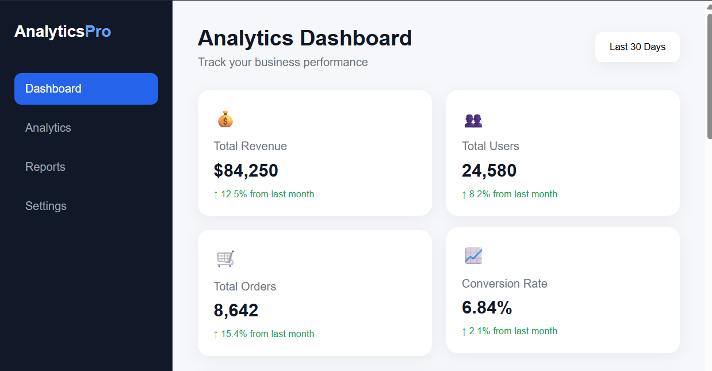
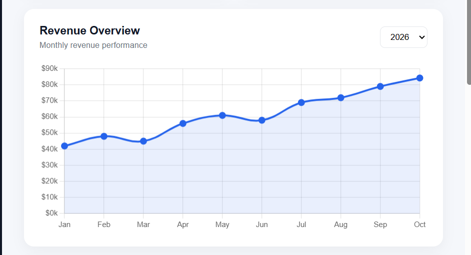

# 📊 Analytics Dashboard

A modern and responsive **Analytics Dashboard** designed to visualize business performance using interactive charts, KPI cards, insights, and transaction data.

## 👥 Team Project

**Overall Topic:** Analytics & Data Visualization

**UI Template:** Analytics Dashboard

**Team Name:** DATASPHERE

### Team Members

* D.Sri Charan Reddy
* G.V.Santosh Reddy
* S.Sai teja
* K.Venkata Nishanth Reddy

---

## 📌 What is an Analytics Dashboard?

An Analytics Dashboard is a visual interface that presents important business data in an easy-to-understand format.

It combines **Key Performance Indicators (KPIs), charts, graphs, tables, and insights** so users can quickly understand business performance and make data-driven decisions.

---

## 🌐 Where is it Commonly Used?

Analytics dashboards are commonly used in:

* Business and enterprise applications
* E-commerce platforms
* Marketing platforms
* Financial applications
* SaaS products
* Sales management systems
* Customer analytics platforms
* Business intelligence tools

---

## 🚀 Why is it Relevant to Modern Interfaces?

Modern applications generate large amounts of data. Presenting this information through dashboards makes it easier for users to understand important trends and performance.

Analytics dashboards are relevant because they:

* Reduce complex data into simple visual information
* Help users identify trends quickly
* Support data-driven decision making
* Provide real-time or regularly updated information
* Improve productivity and monitoring

---

## 🎨 Modern Design & Interaction Patterns

The dashboard uses several modern interface patterns:

* KPI cards for important metrics
* Responsive grid-based layout
* Interactive charts and graphs
* Sidebar navigation
* Clear visual hierarchy
* Hover interactions
* Status indicators
* Data tables
* Responsive design for different screen sizes
* Clean spacing and consistent typography

---

## 💡 What Our Implementation Adds

Our Analytics Dashboard provides a clean and practical interface for monitoring business performance.

The implementation includes:

* Revenue overview visualization
* Sales performance chart
* Traffic source analysis
* Total revenue KPI
* Total users KPI
* Total orders KPI
* Conversion rate KPI
* Key business insights
* Recent transactions table
* Responsive layout
* Interactive Chart.js visualizations

The goal is to make important business information understandable at a glance while maintaining a clean and modern interface.

---

## 🛠️ Technologies Used

* **HTML5** – Structure of the dashboard
* **CSS3** – Styling, layout and responsive design
* **JavaScript** – Interactions and functionality
* **Chart.js** – Interactive charts and data visualization

---

## 📈 Dashboard Components

### KPI Cards

* Total Revenue
* Total Users
* Total Orders
* Conversion Rate

### Charts

* Revenue Overview
* Sales Performance
* Traffic Sources

### Other Components

* Key Insights
* Recent Transactions
* Sidebar Navigation
* Date Range Selector

---

## ▶️ How to Run

1. Download or clone the project repository.
2. Open the `analytics-dashboard` folder.
3. Open `index.html` in a web browser.

Alternatively, use **VS Code Live Server**:

1. Open the project in VS Code.
2. Right-click `index.html`.
3. Select **Open with Live Server**.
4. The Analytics Dashboard will open in the browser.

---

## 📂 Project Structure

```text
analytics-dashboard/
│
├── index.html
├── style.css
├── script.js
├── README.md
├── screenshot-top.png
└── revenue-chart.png
```

---

## 📸 Screenshots


### Dashboard Overview


### Revenue Analytics



---

## 🔗 Team Collaboration

This project is developed as part of a GitHub team collaboration activity.

The workflow followed is:

**Fork → Clone → Branch → Develop → Commit → Push → Pull Request → Review → Merge**

Each team member works on an individual UI template using a separate branch and contributes through Pull Requests.

---

## 📚 Conclusion

The Analytics Dashboard demonstrates how HTML, CSS, and JavaScript can be combined to create a modern data visualization interface.

The project focuses on presenting business information through clear KPIs, interactive charts, insights, and structured tables while maintaining responsive and user-friendly design.
